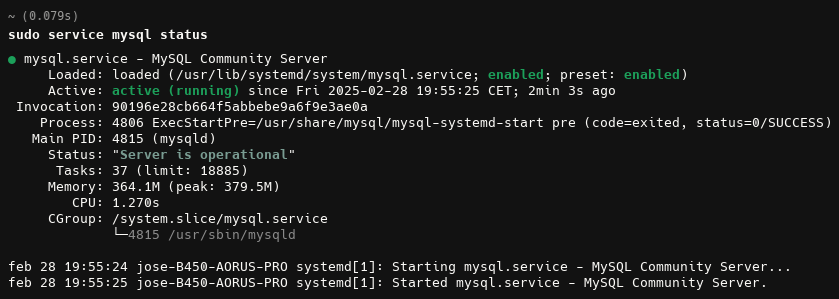
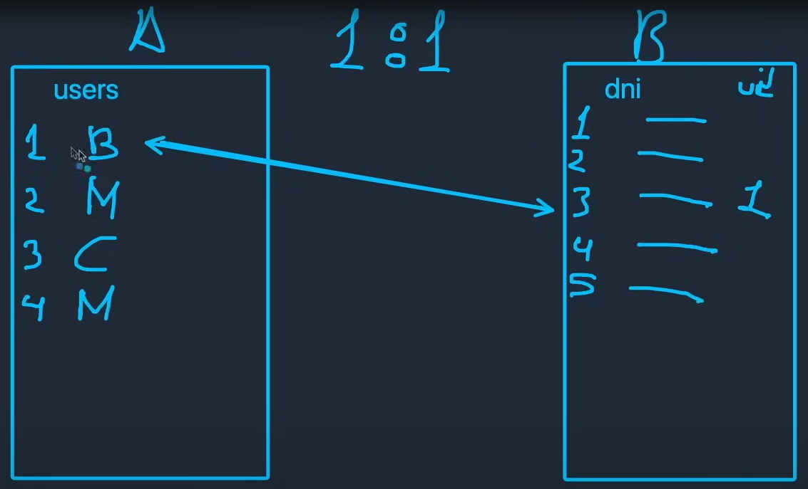

# Curso de SQL y Bases de datos

## 1. Bases de datos SQL

- SQL es un lenguaje de consulta
- SQL → Structure Query Language

SQL es un estándar ANSI desde el año 1986 y un estándar ISO desde el año 1987.

Base de datos **relacional (SQL)**:

Un lugar donde están guardados los datos, pero esos datos, es decir, esas tablas que podemos tener guardan relaciones entre sí y pueden tener dependencias una de la otra.

Base de datos **no relacional (NoSQL)**:

En esta en cambio, todos estos datos son independientes, es decir, nosotros tendremos por un lado el esquema de Netflix por ejemplo, pero después tendremos el documento de usuarios y el documento de las películas. Pero inicialmente no está pensado para que nosotros podamos relacionar muy rápidamente la tabla de usuarios con la tabla de películas.

Cada tipo de base de datos está enfocado en lo suyo, es decir, si tenemos datos que se tienen que relacionar de forma profunda, entonces base de datos relacional, en cambio si tenemos datos a los cuales queremos acceder rápidamente pero que no queremos relacionarlos con otras entidades, entonces base de datos no relacional.

Aún así no tenemos porque elegir una u otra, ya que en empresas de gran tamaño se usan ambos tipos guardando unas cosas en una y otras cosas en la otra.

## 2. Sistema de gestión de base de datos (DBMS)

DBMS → DataBase Management System

Los principales sistemas de gestión de bases de datos son:

- Oracle DB
- IBM Db2
- SQLite (Este es bastante simple, para proyectos supergrandes no se utiliza tanto, pero para aprender o proyectos modestos nos puede servir de sobra)
- MariaDB (Open Source)
- SQL Server (La de Microsoft)
- PostgreSQL (Open Source y probablemente la opción más popular de la actualidad)
- MySQL (Esta también es de ORACLE y también tiene un parte privativa, pero también tiene otra parte que la podemos usar en su versión Community)

Donde esté el estándar ISO/IEC 9075-1 da igual qué gestor de bases de datos usemos, por lo que la gran mayoría de los mecanismos son los del estándar.

## 3. Fundamentos de SLQ y bases de datos

Una de las mejores páginas para aprender fundamentos a nivel de desarrollo de software es w3schools. Y según Brais es una de las mejores referencias que podemos consultar para aprender las bases de SQL.

Si pensamos en un lenguaje orientado a objetos, que está dividido por clases, donde cada clase nos especifica que está modelando o qué está representando. Aquí tenemos el concepto de “Entidad”.

Una base de datos está compuesta por tablas.

Existen las relaciones uno a uno (1:1), uno a muchos (1:n), muchos a muchos (n:n). 

El estándar de base de datos relacional y el estándar de SQL nos permite trabajar con varios tipos de datos.

En los diferentes gestores de bases de datos se pueden encontrar subtipos o nuevos tipos personalizados, pero aquí nos vamos a quedar con los estándares.

Para consultarlos en profundidad: [https://www.w3schools.com/sql/sql_datatypes.asp](https://www.w3schools.com/sql/sql_datatypes.asp)

## 4. Configuración e instalación

Vamos a trabajar con RDBMS que básicamente es un gestor de bases de datos relacional. Concretamente con MySQL.

En este caso, como voy a trabajar en Kubuntu 24.10, voy a seguir las instrucciones de instalación de la página oficial de documentación de Ubuntu: [https://documentation.ubuntu.com/server/how-to/databases/install-mysql/](https://documentation.ubuntu.com/server/how-to/databases/install-mysql/)

Hacemos **sudo apt install mysql-server**

Comprobamos si el servicio mysql está funcionando:



Comprobamos la versión de mysql instalada:


## 5. Primeros pasos

Con todo esto ya podemos interactuar con una base de datos.


¿Podemos manejar una base de datos sólo con comados?

Sí.

¿Es recomendable?

Sólo si somos muy pros o si tenemos que hacer algo muy concreto igual que desde una herramienta o interfaz gráfica quizás no somos capaces de resolver tan fácil.


Como se puede ver, mysql ya tiene 4 bases de datos instaladas por defecto.

Con **exit** podemos salir del terminal.

## 6. Conexión y cliente SQL

Existen infinidad de aplicaciones para interactuar con la base de datos, por ejemplo:

- DbVisualizer
- phpMyAdmin
- dbForge
- SQLPro Studio
- TablePlus

Para el curso vamos a utilizar la herramienta de bases de datos propia de la gente que está desarrollando mysql: https://dev.mysql.com/downloads/workbench


Pero al tratar de conectarme me surgió este error (Estaba usando Kubuntu 24.10)


Y al parecer (según ChatGPT), Ubuntu en algunas versiones, configura MySQL para que el usuario **root** use **auth_socket**, lo que significa que solo puedo identificarse desde la terminal con **sudo**.


Ahora si volvemos a intentar realizar la conexión:


Creamos una nueva base de datos o esquema de base de datos llamado hello_mysql:


## 7. Inicialización de datos

Creamos una nueva conexión que nos dirija directamente a la base de datos que acabamos de crear:


Y ya la tenemos disponible:


Usamos esta nueva conexión y creamos una nueva tabla en “hello_mysql”. usando la interfaz gráfica.


Nota: El tipo de dato “date” representa una fecha sin hora


Si nos fijamos en los iconos, vemos una “i” que sirve para ver la información de la tabla, una “llave” que sirve para modificar directamente desde la interfaz dicha tabla y el icono de la derecha sirve para consultar el contenido de dicha tabla.

Nota: El formato estándar para las fechas en SQL es: yyyy-mm-dd

Nota: El auto increment incrementa a partir del último identificador que nosotros teníamos.

Rellenamos la tabla usando la interfaz:


## 8. Consulta de datos: SELECT

<aside>
💡

Por convención en SQL las palabras reservadas del lenguaje se escriben en mayúscula

</aside>

Las sentencias SQL sirven para trabajar con lo que tenemos en la base de datos.

```sql
SELECT * FROM users;

SELECT name FROM users;

SELECT user_id, name FROM users;
```

## 9. Modificadores: Parte 1

### 9.1 DISTINCT

<aside>
💡

Si nos surge algún error al ejecutar un comando SQL, podemos copiar el código de error y buscarlo en Google.

</aside>

Con DISTINCT le indicamos a SQL que sólo muestre aquellos campos que sean distintos.

```sql
SELECT DISTINCT age from users;

SELECT DISTINCT name from users;
```


Como se puede ver a pesar de que teníamos 2 users con la misma edad, no nos muestra el 15 dos veces, ya que únicamente muestra resultados que sean distintos.

### 9.2 WHERE

Con el WHERE estamos limitando cuál es el criterio de los datos que nosotros queremos recuperar.


```sql
SELECT * FROM users WHERE age = 15;

SELECT name FROM users WHERE age = 15;

SELECT DISTINCT age FROM users WHERE age = 15;
```

### 9.3 ORDER BY

ORDER BY nos permite ordenar los resultados.

<aside>
💡

Por defecto se aplica el orden ASCENDENTE

</aside>


Vamos a añadir el mismo email de Sara a Carlos Azaustre:


Por lo tanto si lanzamos esta consulta:


```sql
SELECT * FROM users ORDER BY age;

SELECT * FROM users ORDER BY age ASC;

SELECT * FROM users ORDER BY age DESC;

SELECT * FROM users WHERE email='sara@gmail.com' ORDER BY age DESC;

SELECT name FROM users WHERE email='sara@gmail.com' ORDER BY age DESC;
```

### 9.4 LIKE

Modificamos el email de Miriam para que sea un gmail:


El comando LIKE nos sirve para definir una especie de contiene o se parece a, donde no tenemos el valor final.

<aside>
💡

LIKE se usa siempre con WHERE

</aside>

<aside>
💡

El “%” significa que antes de él en la cadena de texto nos vale cualquier cosa.

</aside>


```sql
SELECT * FROM users WHERE email LIKE '%gmail.com';

SELECT * FROM users WHERE email LIKE 'sara%';

SELECT * FROM users WHERE email LIKE '%@%';
```

### 9.5 AND, OR, NOT

Si queremos consultar aquellos usuarios cuyo email no se “sara@gmail.com”:


Añadiendo la condición AND para que sólo muestre los que tengan dicho email y cuya edad sea 15 años:


Y si queremos consultar aquellos usuarios que cumplan una u otra condición, o ambas, entonces usamos OR:


```sql
SELECT * FROM users WHERE NOT email = 'sara@gmail.com';

SELECT * FROM users WHERE NOT email = 'sara@gmail.com' AND age = 15;

SELECT * FROM users WHERE NOT email = 'sara@gmail.com' OR age = 15;
```

### 9.6 LIMIT

LIMIT sirve para limitar el número de resultados que nos va a mostrar la consulta.

Un par de ejemplos:


Esto sirve para casos donde la base de datos tiene una gran cantidad de datos (por ejemplo millones de usuarios) y queremos realizar una consulta, dado que de ser así, tardaría mucho en realizar la consulta.


```sql
SELECT * FROM users LIMIT 3;

SELECT * FROM users WHERE NOT email = 'sara@gmail.com' OR age = 15 LIMIT 2;
```

## 10. Modificadores: Parte 2

### 10.1 Comentarios

```sql
-- Comentario en una línea

/*
Este
es
un
comentario
multilínea
*/
```

### 10.2 NULL


```sql
SELECT * FROM users WHERE email IS NULL; 

SELECT * FROM users WHERE email IS NOT NULL; 

SELECT * FROM users WHERE email IS NOT NULL AND age = 15; 
```

### 10.3 MIN, MAX


```sql
SELECT MAX(age) FROM users;

SELECT MIN(age) FROM users;
```

### 10.4 COUNT


```sql
SELECT COUNT(*) FROM users;

SELECT COUNT(age) FROM users;
```

### 10.5 SUM


```sql
SELECT SUM(age) FROM users;
```

### 10.6 AVG


```sql
SELECT AVG(age) FROM users;
```

### 10.7 IN

El comando IN es capaz de hacer un filtrado en el que nosotros conocemos cuáles son precisamente los datos por los que hay que filtrar. Es una especie de límite basado en uno o varios elementos que nosotros conocemos.


```sql
SELECT * FROM users WHERE name IN ('brais', 'sara');
```

### 10.8 BETWEEN

Este comando nos sirve para encontrar resultados que se comprenden entre 2 valores, un valor mínimo y un valor máximo. 


```sql
SELECT * FROM users WHERE age BETWEEN 20 AND 30;
```

### 10.9 ALIAS

<aside>
💡

En SQL podemos usar tanto comillas simples como dobles.

</aside>


```sql
SELECT name, init_date AS "Fecha de inicio en programación" FROM users WHERE name = "Brais";

SELECT name, init_date AS 'Fecha de inicio en programación' FROM users WHERE name = 'Brais';
```

### 10.10 CONCAT

Existe una ligera variación dentro de ALIAS que nos permite concatenar cadenas, que nos permite concatenar atributos, que nos permite concatenar columnas.

Por ejemplo, ¿Cómo podríamos concatenar en una misma columna el nombre y el apellido?


```sql
SELECT name, init_date AS "Fecha de inicio en programación" FROM users WHERE name = "Brais";

SELECT name, init_date AS 'Fecha de inicio en programación' FROM users WHERE name = 'Brais';

SELECT CONCAT(name, surname) FROM users;

SELECT CONCAT('Nombre: ', name, ' Apellidos: ', surname) FROM users;

SELECT CONCAT('Nombre: ', name, ' Apellidos: ', surname) AS "Nombre completo" FROM users;
```

### 10.11 GROUP BY

Agrupa filas que tienen mismos valores.

Buscamos las máximas edades de cada grupo:


Contamos las edades:


Contamos las edades y además ordenamos de forma ascendente:


Y si además ponemos una restricción para que sólo nos muestre las edades superiores a 15:

```sql
SELECT MAX(age) FROM users GROUP BY age;

SELECT COUNT(age), age, FROM users GROUP BY age;

SELECT COUNT(age), age FROM users GROUP BY age ORDER BY age ASC;

SELECT COUNT(age), age FROM users WHERE age > 15 GROUP BY age ORDER BY age ASC;
```

### 10.12 HAVING

Sirve para crear limitaciones a los resultados de agrupaciones. 

<aside>
💡

Los HAVING se usan bastante con los GROUP BY.

</aside>


```sql
SELECT COUNT(age) FROM users HAVING COUNT(age) > 3;
```

### 10.13 CASE

Un CASE nos permite ejecutar una lógica concreta en función de una condición. 


Añadimos un nuevo usuario a la tabla users llamado “Kontrol” que tiene 18 años.


```sql
SELECT *,
CASE
	WHEN age > 17 THEN 'Es mayor de edad'
    ELSE 'Es menor de edad'
END AS agetext
FROM users;

SELECT *,
CASE
	WHEN age > 17 THEN True
    ELSE False
END AS '¿Es mayor de edad?'
FROM users;

SELECT *,
CASE
	WHEN age > 18 THEN 'Es mayor de edad'
    WHEN age = 18 THEN 'Acaba de cumplir la mayoría de edad'
    ELSE 'Es menor de edad'
END AS '¿Es mayor de edad?'
FROM users;
```

### 10.14 IFNULL


```sql
SELECT COUNT(age) FROM users HAVING COUNT(age) > 3;
```

### 10.15 Otros modificadores

[https://www.w3schools.com/sql/sql_ref_mysql.asp](https://www.w3schools.com/sql/sql_ref_mysql.asp)

## 11. Escritura de datos

### 11.1 INSERT

Vemos como antes de la última ejecución, si intentábamos insertar el user_id 7 nos daba error, puesto que en la clave primaria no puede haber ni nulos ni duplicados.


```sql
INSERT INTO users (user_id, name, surname) VALUES (8, 'María', 'López');

INSERT INTO users (name, surname) VALUES ('Paco', 'Pérez');

INSERT INTO users (user_id, name, surname) VALUES (11, 'El', 'Merma');
```

Después de los inserts el estado de la tabla es el siguiente:


### 11.2 UPDATE

<aside>
💡

Los UPDATE siempre se hacen con una regla de filtrado

</aside>


```sql
UPDATE users SET age = '21' WHERE user_id = 11;

UPDATE users SET age = '20' WHERE user_id = 11;

UPDATE users SET age = 20, init_date = '2020-10-12' WHERE user_id = 11;
```

Tras ejecutar las sentencias UPDATE la tabla users nos queda así:


### 11.3 DELETE

<aside>
💡

Al igual que en el caso de update, tenemos que usar una regla de filtrado

</aside>

Borramos al usuario “El Merma”:

```sql
DELETE from users WHERE user_id = 11;
```

## 12. Administración de la base de datos

### 12.1 CREATE DATABASE

```sql
CREATE DATABASE test;
```

### 12.2 DROP DATABASE

```sql
DROP DATABASE test;
```

## 13. Administración de tablas

Para no interferir con el trabajo realizado previamente, vamos a crear de nuevo la base de datos “test” y sobre esta vamos a empezar a trabajar.

Además, vamos a crear una nueva conexión en MySQL Workbench que vaya directamente a la base de datos “test”:


### 13.1 CREATE TABLE

```sql
CREATE TABLE people (
	id int,
    name varchar(100),
    age int,
    email varchar(50),
    created date
);
```


### 13.2 NOT NULL

NOT NULL es una restricción a nivel de columna que nos impide insestar datos nulos en las filas de dicha columna.

Creamos una segunda tabla llamada “people2” en la que hacemos uso de la restricción “NOT NULL” para dos de sus columnas:

```sql
CREATE TABLE people2 (
	id int NOT NULL,
    name varchar(100) NOT NULL,
    age int,
    email varchar(50),
    created date
);
```


### 13.3 UNIQUE

Con la restricción UNIQUE a nivel de columna, lo que conseguimos es que no puedan haber duplicados en dicha columna, es decir, no podremos insertar 2 veces el mismo valor en dicha columna.

```sql
CREATE TABLE people3 (
	id int NOT NULL,
    name varchar(100) NOT NULL,
    age int,
    email varchar(50),
    created datetime,
    UNIQUE(id)
);
```


### 13.4 PRIMARY KEY

PRIMARY KEY nos sirve para indicar cuál o cuales son los identificadores principales de la tabla. 

Esto nos va a servir para que cuando una tabla se tenga que relacionar con otras, este va a ser el campo principal que va a servir para designar cada uno de los registros. 

```sql
CREATE TABLE people4 (
	id int,
    name varchar(100) NOT NULL,
    age int,
    email varchar(50),
    created datetime,
    PRIMARY KEY(id)
);
```

### 13.5 CHECK

CHECK nos sirve para añadir restricciones a la hora de crear una tabla.

```sql
CREATE TABLE people5 (
	id int,
    name varchar(100) NOT NULL,
    age int,
    email varchar(50),
    created datetime,
    PRIMARY KEY(id),
    CHECK(age >= 18)
);
```

De hecho si comprobamos el script de creación de la tabla:


### 13.6 DEFAULT

Nos sirve para establecer valores por defecto para las columnas de la tabla, de forma que evitamos que se quede un valor nulo en dicha columna.

Como ejemplo vamos a añadir un valor default a la columna “created” de forma que usando una función de MySQL nos cargue la fecha y la hora del sistema:

```sql
CREATE TABLE people6 (
	id int,
    name varchar(100) NOT NULL,
    age int,
    email varchar(50),
    created datetime DEFAULT CURRENT_TIMESTAMP(),
    PRIMARY KEY(id),
    CHECK(age >= 18)
);
```


### 13.7 AUTO INCREMENT

Con AUTO_INCREMENT podemos indicar que cada vez que se inserte un nuevo dato, utilice el último identificador que exista en la base de datos, y lo va a autoincrementar.

```sql
CREATE TABLE people7 (
	id int NOT NULL AUTO_INCREMENT,
    name varchar(100) NOT NULL,
    age int,
    email varchar(50),
    created datetime DEFAULT CURRENT_TIMESTAMP(),
    PRIMARY KEY(id),
    CHECK(age >= 18)
);
```

### 13.8 DROP TABLE

```sql
CREATE TABLE people8(
	name varchar(100) NOT NULL
);

DROP TABLE people8;
```

### 13.9 ALTER TABLE & ADD

Con ALTER TABLE podemos modificar la estructura de la tabla.

Podemos modificarla añadiendo, borrando, renombrando cosas o hasta cambiando el tipo de dato.

```sql
CREATE TABLE people8 (
	id int NOT NULL AUTO_INCREMENT,
    name varchar(100) NOT NULL,
    age int,
    email varchar(50),
    created datetime DEFAULT CURRENT_TIMESTAMP(),
    PRIMARY KEY(id),
    CHECK(age >= 18)
);

ALTER TABLE people8 
ADD surname varchar(150);
```

Si consultamos la tabla:


### 13.11 RENAME COLUMN

Este sirve para renombrar un campo.

```sql
ALTER TABLE people8
RENAME COLUMN surname TO description;
```


### 13.12 MODIFY COLUMN

Este en cambio sirve para actualizar el tipo de un campo.

```sql
ALTER TABLE people8
MODIFY COLUMN description varchar(250);
```


### 13.13 DROP COLUMN

```sql
ALTER TABLE people8
DROP COLUMN description;
```


## 14. Relaciones entre tablas

### 14.1 RELACIÓN 1:1



El uid en la tabla B es lo que conocerémos como clave foránea (foreign key), la cual es una clave que no pertenece a esta tabla, pero que pertenece a otra tabla, es decir, en este caso, la clave foránea userId es la clave primaria de la tabla users.

### 14.2 RELACIÓN 1:N


### 14.3 RELACIÓN N:M


### 14.4 AUTOREFERENCIA


## 15. Creación de tablas relacionadas

Vamos a volver a trabajar sobre “hello_mysql”, la primera base de datos que teníamos antes.

### 15.1 TABLAS 1:1

```sql
CREATE TABLE dni(
	dni_id int AUTO_INCREMENT PRIMARY KEY,
    dni_number int NOT NULL,
    user_id int,
    UNIQUE(dni_id),
    FOREIGN KEY(user_id) REFERENCES users(user_id)
);
```

### 15.2 TABLAS 1:N

```sql
CREATE TABLE companies(
	company_id int AUTO_INCREMENT PRIMARY KEY,
    name varchar(100) NOT NULL
);

ALTER TABLE users
ADD company_id varchar(100);
```

Actualizamos el tipo de dato de company_id de la tabla users por el tipo int.

```sql
ALTER TABLE users
ADD CONSTRAINT fk_companies
FOREIGN KEY(company_id) REFERENCES companies(company_id);
```

### 15.2 TABLAS 1:N

```sql
CREATE TABLE languages(
	language_id int AUTO_INCREMENT PRIMARY KEY,
    name varchar(100) NOT NULL
);

CREATE TABLE users_languages(
	users_language_id int AUTO_INCREMENT PRIMARY KEY,
    user_id int,
    language_id int, 
    FOREIGN KEY(user_id) REFERENCES users(user_id),
    FOREIGN KEY(language_id) REFERENCES languages(language_id),
    UNIQUE(user_id, language_id)
);
```

## 16. Almacenamiento de datos relacionados

U = Tabla Usuarios

UL = Tabla Usuarios-Lenguajes

L = Tabla Lenguajes

D = Tabla DNIs

C = Tabla Compañías


### 16.1 DATOS 1:1

```sql
INSERT INTO dni(dni_number, user_id) VALUES (11111111, 1);
INSERT INTO dni(dni_number, user_id) VALUES (22222222, 2);
INSERT INTO dni(dni_number, user_id) VALUES (33333333, 3);
INSERT INTO dni(dni_number) VALUES (44444444);
```

### 16.2 DATOS 1:N

```sql
INSERT INTO companies (name) VALUES ('MoureDev');
INSERT INTO companies (name) VALUES ('Apple');
INSERT INTO companies (name) VALUES ('Google');
INSERT INTO companies (company_id) VALUES (5); -- Este falla porque name es NOT NULL

UPDATE users SET company_id = 1 WHERE user_id = 1;
UPDATE users SET company_id = 2 WHERE user_id = 3;
UPDATE users SET company_id = 3 WHERE user_id = 4;
UPDATE users SET company_id = 1 WHERE user_id = 7;
```

### 16.3 DATOS N:M

Vamos a corregir una cosa de la tabla user_languages y es poner los atributos user_id y language_id como NOT NULL.


```sql
INSERT INTO languages (name) VALUES ('Swift');
INSERT INTO languages (name) VALUES ('Kotlin');
INSERT INTO languages (name) VALUES ('JavaScript');
INSERT INTO languages (name) VALUES ('Java');
INSERT INTO languages (name) VALUES ('Python');
INSERT INTO languages (name) VALUES ('C#');
INSERT INTO languages (name) VALUES ('COBOL');

INSERT INTO users_languages (user_id, language_id) VALUES (1, 1);
INSERT INTO users_languages (user_id, language_id) VALUES (1, 2);
INSERT INTO users_languages (user_id, language_id) VALUES (1, 5);
INSERT INTO users_languages (user_id, language_id) VALUES (2, 3);
INSERT INTO users_languages (user_id, language_id) VALUES (2, 5);
INSERT INTO users_languages (user_id, language_id) VALUES (1, 1); -- Este falla porque la combinación de user_id y language_id ya existe
INSERT INTO users_languages (user_id) VALUES (1); -- Este falla porque language_id es NOT NULL
```

## 17. Consulta de datos relacionados

Los JOIN son una instrucción o comando que nos sirve para relacionar 2 o más tablas, es decir, para combinar los datos que hay en varias tablas.

### 17.1 INNER JOIN

Es un comando que nos sirve para obtener los datos **comunes** de ambas tablas.

Al final nos va a retornar las filas de 2 o más tablas cuando hay coincidencias en dichas tablas.

Pensemos en la relación 1:1 que tenemos entre la tabla de usuarios y la tabla de DNIs, e imaginemos que ahora por los requisitos de nuestra aplicación o los datos que necesitamos o lo que sea, yo ahora lo que quiero traerme son todos los usuarios con sus DNIs, por que a lo mejor queremos listar dichos usuarios junto con sus DNIs en mi aplicación o por lo que sea.

<aside>
💡

Un JOIN siempre va a tener que acabar estableciendo cuál es el campo que va a utilizar para realizar esa unión

</aside>

```sql
SELECT * FROM users 
INNER JOIN dni;

SELECT * FROM users 
INNER JOIN dni
ON users.user_id = dni.user_id;
```


El INNER JOIN se queda con la parte en rojo, es decir, se queda con los datos que son comunes entre ambas tablas, nunca nos va a traer usuarios que no tienen dni y nunca nos va a traer DNIs que no tienen usuarios asignados.

<aside>
💡

En la gran mayoría de bases de datos, escribir INNER JOIN es lo mismo que escribir JOIN

</aside>

Ejemplo de JOIN con relación 1:1:

```sql
SELECT name, dni_number FROM users
JOIN dni
ON users.user_id = dni.user_id
ORDER BY age ASC;
```

Resultado:


Ejemplo de JOIN con relación 1:N:

```sql
SELECT * FROM users
JOIN companies
ON users.company_id = companies.company_id;

-- Se pueden intercambiar de sitio las tablas y no hay problema (Sólo cambiaría el orden del resultado)
SELECT * FROM companies
JOIN users
ON users.company_id = companies.company_id;

SELECT companies.name, users.name FROM companies
JOIN users
ON companies.company_id = users.company_id;
```

El resultado para la última consulta es:


Para el caso de la relación N:M vamos a tener que hacer un JOIN entre 3 tablas.

Ejemplo de JOIN con relación N:M:

```sql
SELECT users.name, languages.name
FROM users_languages
JOIN users ON users_languages.user_id = users.user_id
JOIN languages ON users_languages.language_id = languages.language_id;
```

<aside>
💡

JOIN es un comando para poder unir tablas en base a un criterio

</aside>

### 17.2 LEFT JOIN

El LEFT JOIN siempre se va a traer todo lo que tiene la tabla de la izquierda y con los datos en común, pero no con los datos de la derecha.


```sql
SELECT * FROM users
LEFT JOIN dni
ON users.user_id = dni.user_id;
```


Por ejemplo, para aplicar este JOIN vamos a imaginar que un requisito de nuestra aplicación es mostrar a todos los usuarios y sus DNIs, los tengan o no.

```sql
SELECT name, dni_number FROM users
LEFT JOIN dni
ON users.user_id = dni.user_id;
```


Como vemos rellena con nulos los casos en los que el usuario no dispone de dni.

Si hacemos el LEFT JOIN a la inversa, entonces:

```sql
SELECT name, dni_number FROM dni
LEFT JOIN users
ON users.user_id = dni.user_id;
```


Un último ejemplo:

```sql
SELECT users.name, languages.name
FROM users
LEFT JOIN users_languages ON users.user_id = users_languages.user_id
LEFT JOIN languages ON users_languages.language_id = languages.language_id;
```


### 17.3 RIGHT JOIN


```sql
SELECT * FROM users
RIGHT JOIN dni
ON users.user_id = dni.user_id;

SELECT name, dni_number FROM users
RIGHT JOIN dni
ON users.user_id = dni.user_id;

SELECT name, dni_number FROM dni
RIGHT JOIN users
ON users.user_id = dni.user_id;

SELECT users.name, languages.name
FROM users
RIGHT JOIN users_languages ON users.user_id = users_languages.user_id
RIGHT JOIN languages ON users_languages.language_id = languages.language_id;
```

### 17.3 UNION

El FULL JOIN se va a quedar con todo evidentemente.

<aside>
💡

En algunas bases de datos podemos encontrar los JOIN por ejemplo con el formato RIGHT OUTER JOIN o LEFT OUTER JOIN

</aside>


```sql
SELECT users.user_id AS u_user_id, dni.user_id AS d_user_id
FROM users
LEFT JOIN dni
ON users.user_id = dni.user_id
UNION ALL
SELECT users.user_id AS u_user_id, dni.user_id AS d_user_id
FROM users
RIGHT JOIN dni
ON users.user_id = dni.user_id;
```


## 18. Conceptos avanzados

### 18.1 INDEX

Un índice es un elemento que se puede crear en una tabla de una base de datos, y si hacemos un símil con el índice de un libro, pues es algo que nos permite llegar a los datos o a una página antes.

En resumen, un index en SQL es básicamente una estructura de datos que nos va a permitir indexar la tabla para poder consultar datos y poder realizar operaciones sobre esa tabla de la base de datos mucho más rápido.

Existen diferentes tipos de índices:

- Hay índices primarios (PRIMARY INDEX), que están vinculados con la clave primaria de la tabla.
- Hay índices únicos (UNIQUE INDEX), que aseguran que 2 filas de una tabla al final no tengan valores duplicados.
- Y los índices compuestos, que van a permitir que se utilicen 2 o más columnas.

Existen diferentes índices porque los criterios de búsqueda de una tabla pueden ser diferentes a los de otra. 

Entonces, ¿Por qué hay que crear índices y cúando no hay que crear índices?

Primero, el crear índices hace que la tabla pese más, es decir, va a ocupar más espacio, por lo que si bien es cierto que acelera la consulta de datos pero por el contrario, lo que va a provocar es que cuando nosotros escribamos datos en esa tabla, esa escritura va a ser más lenta, porque se van a escribir datos y además se va a tener que regenerar el índice para ahora tener en cuenta ese nuevo dato, el índice asociado y volver a crear otra vez ese mecanismo.

En resumen, los índices provocan en términos generales, que la tabla puede funcionar de forma más rápida en modo lectura, pero de forma más lenta en escritura.

Por supuesto, creación y eliminación lo vamos a poder hacer con los índices, pero todo eso puede acabar repercutiendo en la tabla.

Por todo esto, hay que tener mucho cuidado y hay que estudiar muy bien una tabla a la hora de decidir crear o no índices y en qué columnas o en qué campos o en qué atributos o en qué registros al fin y al cabo, son los que nos afectan para decidir si queremos crear o no un índice.

Vamos con un ejemplo.

Si consideramos la tabla users, imaginemos que la lógica de la aplicación es que habitualmente cuando nosotros consultamos esta tabla y queremos ir por un campo en concreto, en lo que nos solemos centrar es en que solemos pedir el usuario por nombre, por que obligamos por ejemplo en dicha aplicación a que se busque por nombre.

Entonces claro, en este caso en la gran mayoría de búsquedas el campo que tenemos en cuenta es el nombre y ese puede ser un punto susceptible para que le pongamos un índice a la columna de nombre.

<aside>
💡

Como buena práctica se recomienda que cuando se declare un índice se haga empezando por idx_

</aside>

```sql
CREATE INDEX idx_name ON users(name);
```

Si consultamos la tabla users ahora vemos que ya había algunos índices. Por ejemplo asociado a la clave primaria y es que habitualmente las claves primarias suelen ser índices para realizar búsquedas un poco más rápidas cuando empezamos a traer todos los datos, cuando relacionamos, asociamos, etc.


Si queremos crear un índice único:

```sql
CREATE UNIQUE INDEX idx_name ON users(name);
```

Si queremos borrar el índice:

```sql
DROP INDEX idx_name ON users;
```

Si por el contrario queremos trabajar con un índice compuesto:

```sql
CREATE UNIQUE INDEX idx_name_surname ON users(name, surname);
```


Nota: Vamos a dejar creado el primer índice que hemos creado.

### 18.2 TRIGGER

Un trigger si lo traducimos de manera directa es un “disparador”, por lo que son instrucciones que se ejecutan automáticamente cuando ocurren eventos en la tabla, es decir, no son consultas que nosotros hacemos sino que nosotros programamos un evento que nosotros queremos que ocurra cuando pase algo en una tabla concreta.

Por ejemplo, vamos a poner el caso de que si un usuario actualiza su email, que se guarde en otra tabla el email que tenía anteriormente.

Claro si no hablamos puramente de bases de datos y pensamos en lógica de programación pura y dura, ¿Cuál sería el flujo? 

Yo tengo una aplicación que permite actualizar el email, pero claro queremos guardar el email anterior por si hay algún problema, notificar al email de antes o recordarle cuál era el email de antes…

¿Cómo hacemos esto?

Pues cuando el usuario actualice el email, yo después desde mi aplicación también lanzo una ejecución que guarde el email antiguo en otra tabla de base de datos, pero claro, **esto lo puede hacer directamente la base de datos. Eso es un trigger.**

Un trigger es un disparador que va a detectar que cuando se actualice el campo de email, va a guardar el campo de email anterior (el campo viejo) en otra tabla de base de datos.

Creamos una nueva tabla  llamada “email_history” usando la interfaz directamente:

```sql
CREATE TABLE `hello_mysql`.`email_history` (
  `email_history_id` INT NOT NULL AUTO_INCREMENT,
  `user_id` INT NOT NULL,
  `email` VARCHAR(100) NULL,
  PRIMARY KEY (`email_history_id`),
  UNIQUE INDEX `idemail_history_UNIQUE` (`email_history_id` ASC) VISIBLE);

```

<aside>
💡

Para los TRIGGER podemos indicar si queremos que se ejecuten antes o después de la ejecución de un INSERT, un UPDATE o un DELETE utilizando BEFORE y AFTER

</aside>

```sql
CREATE TRIGGER tg_email
AFTER UPDATE ON users
FOR EACH ROW
BEGIN
	IF OLD.email <> NEW.email THEN
		INSERT INTO email_history (user_id, email)
        VALUES (OLD.user_id, OLD.email);
	END IF;
END;

|

delimiter ;

UPDATE users SET email = "mouredev@gmail.com" WHERE user_id = 1;
```

Si ahora consultamos la tabla email_history:


Si queremos borrar un trigger es tán fácil como:

```sql
DROP TRIGGER tg_email;
```

### 18.3 VIEW

Una view es una representación virtual de 1 o más tablas, es decir, es como una tabla pero que en realidad no es una tabla, sino que es el resultado de cómo se representaría en formato tabla una consulta.

Las vistas básicamente las utilizamos para simplificar consultas complejas, ocultar complejidad, para revisar datos de forma muy rápida, al fin y al cabo para simplificar y securizar.

Imaginemos que hay una vista muy concreta en la que yo siempre quiero mostrar los usuarios con la edad, porque es una representación que yo lanzo muchas veces y a mí me interesa tenerla almacenada, porque lo consulto muchísimas veces, hay muchísimas veces en mi aplicación que yo me quiero traer los datos de cómo se vería representado el usuario y su edad.

Entonces esto es como crear esa tabla intermedia que nos guarda esos datos pero de manera ficticia, no se crea una tabla, pero si que tiene la representación de esa tabla.

En este caso, como ejemplo vamos a crear una vista que donde me gustaría que se represente los nombres de usuario y la edad de sólo los usuarios que sean mayores de edad:

```sql
CREATE VIEW v_adult_users AS
SELECT name, age
FROM users
WHERE age >= 18;

SELECT * FROM v_adult_users;
```


¿Pero que pasa si actualizamos la edad de un usuario en la tabla users y hacemos que sea mayor de edad?


De repente Miriam aperece al volver a ejecutar el select sobre la lista, y aquí es donde de verdad está esa pequeña penalización, esto nos pasa de forma parecida en los índices, ya que las vistas al fin y al cabo se tienen que acabar regenerando, así que en el momento en el nosotros tocamos la tabla por la que se ve afectada la vista o de la que la vista está consultando datos, la lista se tiene que regenerar y esto al final está penalizando a la base de datos.

Por lo tanto, un buen administrador de base de datos al final tiene que sacar esas conclusiones de en qué momento merece la pena la vista, o no merece la pena.

No podemos crear vistas si se consultan una vez al año, pero si todos los días se están lanzando consultas concretas y estos son los datos que queremos tratar, seguramente es mucho más fácil consultar la vista que hacer una consulta típica como la que indicamos en la creación de la vista:

```sql
SELECT name, age
FROM users
WHERE age >= 18;
```

Es mucho más óptimo consultar de la lista si lanzamos cientos de veces esta consulta que lanzar siempre esta consulta.

Si queremos borrar una vista es tan fácil como:

```sql
DROP VIEW v_adult_users;
```

### 18.4 STORED PROCEDURE

Un procedimiento almacenado no deja de ser una query que nosotros acabamos guardando en favoritos, porque esta quizás la acabamos usando mucho, o que es compleja y estamos cansados de estar montándola para lanzarla, pues por ahí es cuando aparecen los procedimientos almacenados.

```sql
DELIMITER //
CREATE PROCEDURE p_all_users()
BEGIN
	SELECT * FROM users;
END//

CALL p_all_users()
```


Si queremos borrar un procedimiento almacenado lo hacemos así:

```sql
DROP PROCEDURE p_age_users;
```

Además podemos pasar parámetros a estos procedimientos almacenados, en la que nosotros le vamos a poder indicar cómo queremos hacer la consulta.

```sql
DELIMITER //
CREATE PROCEDURE p_age_users(IN age_param int)
BEGIN
	SELECT * FROM users WHERE age = age_param;
END//

CALL p_age_users(30);
```

### 18.5 TRANSACCIONES

La transacción es un concepto fundamental en base de datos ya que al final en sistemas que necesitan consistencia, que sean fiables, que las operaciones que nosotros estamos lanzando no la acabemos liando parda con ellas.

Una transacción es algo que se está ejecutando en bloque y aseguran que lo que nosotros queremos ejecutar sólo se ejecute en el caso en que nosotros consideremos que se haya hecho bien esa ejecución.

Esto significa que en SQL podemos indicar que inicie una transacción, lanzar toda la ejecución que nosotros queramos y luego revisar si lo que hemos hecho está bien o mal, porque igual hemos hecho una actualización de un campo por algo que nosotros no queremos permitir de ninguna forma.

Imaginemos que tenemos la base de datos de un banco y de repente estamos actualizando el saldo de una cuenta a negativo y según la lógica de negocio de esa cuenta, nunca puede estar en negativo, y eso es algo que por ejemplo no tenemos controlado y que por lo tanto acabaría siendo una transacción no válida.

Para solucionar esto podemos hacer uso de un ROLLBACK, es decir, devolver la base de datos al estado anterior a dicha transacción.

Por el contrario, si realizamos los cambios en la base de datos y consideremos que son correctos, podríamos confirmar que la transacción es correcta con un COMMIT.

En definitiva, tendremos que declarar cuál es el flujo de una transacción. 

```sql
START TRANSACTION
COMMIT
ROLLBACK
```

Ejemplo teniendo en cuenta que no se puede usar IF … THEN en un script SQL normal, solo en procedimientos almacenados:

```sql
DELIMITER $$

CREATE PROCEDURE updateUser()
BEGIN
    DECLARE valid INT DEFAULT 0;

    START TRANSACTION;

    -- Insertar un usuario
    INSERT INTO users (name, email) VALUES ('John Doe', 'john@gmail.com');

    -- Actualizar el usuario insertado
    UPDATE users SET name = 'Jane Doe', email = 'jane@gmail.com' WHERE name = 'John Doe';

    -- Verificar si la actualización fue exitosa
    SELECT COUNT(*) INTO valid FROM users WHERE name = 'Jane Doe' AND email = 'jane@gmail.com';

    -- Decidir si se confirman los cambios o se revierten
    IF valid > 0 THEN
        COMMIT;
    ELSE
        ROLLBACK;
    END IF;
END $$

DELIMITER ;

```

**EXTRA (CHAT GPT)**

Las **transacciones en SQL con MySQL** permiten agrupar varias operaciones de base de datos en una única unidad de trabajo, asegurando que todas se completen correctamente o que ninguna de ellas se ejecute si ocurre un error. Esto es útil para mantener la integridad y consistencia de los datos.

## 🔹 Conceptos clave de las transacciones

1. **ACID** (Atomicidad, Consistencia, Aislamiento, Durabilidad):
    - **Atomicidad**: Todas las operaciones dentro de la transacción deben completarse; si alguna falla, se deshace todo.
    - **Consistencia**: La base de datos debe pasar de un estado válido a otro estado válido.
    - **Aislamiento**: Cada transacción debe ejecutarse de manera independiente, evitando interferencias.
    - **Durabilidad**: Una vez confirmada, la transacción debe permanecer almacenada incluso en caso de fallo del sistema.
2. **COMMIT y ROLLBACK**:
    - `COMMIT`: Guarda permanentemente los cambios realizados por la transacción.
    - `ROLLBACK`: Revierte los cambios realizados en la transacción si algo falla.
3. **BEGIN / START TRANSACTION**:
    - Indica el inicio de una transacción.

---

## 🔹 Uso de transacciones en MySQL

### 🔸 1. Iniciar una transacción

```sql
START TRANSACTION;  -- También se puede usar BEGIN;

```

### 🔸 2. Ejecutar operaciones

```sql
INSERT INTO cuentas (id, saldo) VALUES (1, 1000);
UPDATE cuentas SET saldo = saldo - 500 WHERE id = 1;

```

### 🔸 3. Confirmar o deshacer cambios

```sql
COMMIT;  -- Guarda los cambios
-- o
ROLLBACK;  -- Revierte los cambios si hay un problema

```

---

## 🔹 Ejemplo práctico: Transferencia entre cuentas

Supongamos que tenemos una tabla `cuentas` con las columnas `id` y `saldo`. Queremos transferir 200€ de la cuenta 1 a la cuenta 2.

```sql
START TRANSACTION;

UPDATE cuentas SET saldo = saldo - 200 WHERE id = 1;  -- Restar 200 a la cuenta 1
UPDATE cuentas SET saldo = saldo + 200 WHERE id = 2;  -- Sumar 200 a la cuenta 2

-- Verificamos que ambas operaciones sean correctas
IF (SELECT saldo FROM cuentas WHERE id = 1) >= 0 THEN
    COMMIT;  -- Guardamos los cambios
ELSE
    ROLLBACK;  -- Si hay saldo insuficiente, cancelamos la transacción
END IF;

```

---

## 🔹 Uso de `SAVEPOINT` y `ROLLBACK TO`

Se pueden definir puntos de guardado dentro de una transacción para revertir solo una parte de ella.

```sql
START TRANSACTION;

UPDATE cuentas SET saldo = saldo - 100 WHERE id = 1;
SAVEPOINT antes_de_error;

UPDATE cuentas SET saldo = saldo + 100 WHERE id = 2;
-- Si hay un problema, revertimos hasta el punto de guardado
ROLLBACK TO antes_de_error;

COMMIT;  -- Confirmamos la transacción

```

---

## 🔹 Habilitar transacciones en MySQL

Para usar transacciones, la tabla debe tener un motor de almacenamiento que las soporte, como **InnoDB**. Para asegurarlo:

```sql
ALTER TABLE cuentas ENGINE=InnoDB;

```

---

## 🔹 Conclusión

Las transacciones en MySQL permiten manejar operaciones críticas con seguridad, evitando inconsistencias en los datos y garantizando que los cambios solo se guarden si todas las operaciones se ejecutan correctamente.

### 18.6 CONCURRENCIA

¿Qué pasa si cuando varios usuarios intentan hacer lo mismo sobre una base de datos?

La mayoría de bases de datos y la gran mayoría de motores de bases de datos permiten configurar diferentes reglas de concurrencia.

Si no existiesen este tipo de mecanismo lo que podría acabar ocurriendo es un interbloqueo (intentar hacer 2 cosas a la vez) o deadlock en el motor de base de datos.

**EXTRA (CHAT GPT)**

### 🔥 **Concurrencia en SQL: Concepto y Manejo en MySQL**

La **concurrencia en SQL** se refiere a la capacidad de un sistema de bases de datos para manejar múltiples transacciones al mismo tiempo, asegurando que los datos se mantengan **consistentes y correctos**, incluso cuando varios usuarios o procesos acceden y modifican la misma información simultáneamente.

---

## 🏛 **Problemas Clásicos de Concurrencia**

Cuando varias transacciones se ejecutan al mismo tiempo, pueden ocurrir problemas si no se manejan correctamente. Algunos de los más comunes son:

### 1️⃣ **Dirty Read (Lectura Sucia)**

Ocurre cuando una transacción **lee datos que aún no han sido confirmados (`COMMIT`)** por otra transacción. Si la otra transacción hace un `ROLLBACK`, la lectura se vuelve inválida.

**Ejemplo**:

- Transacción 1 actualiza el saldo de una cuenta pero aún no hace `COMMIT`.
- Transacción 2 lee el saldo actualizado.
- Transacción 1 hace `ROLLBACK`, pero Transacción 2 ya leyó un valor incorrecto.

---

### 2️⃣ **Non-Repeatable Read (Lectura No Repetible)**

Sucede cuando una transacción **lee los mismos datos dos veces y obtiene valores diferentes** porque otra transacción ha modificado esos datos entre ambas lecturas.

**Ejemplo**:

1. La Transacción 1 lee el saldo de una cuenta bancaria.
2. La Transacción 2 modifica el saldo y hace `COMMIT`.
3. La Transacción 1 vuelve a leer el saldo y obtiene un valor diferente.

---

### 3️⃣ **Phantom Read (Lectura Fantasma)**

Sucede cuando una transacción **lee un conjunto de filas, pero una segunda transacción inserta o elimina filas**, haciendo que los resultados sean diferentes en una nueva lectura dentro de la misma transacción.

**Ejemplo**:

1. Transacción 1 consulta `SELECT * FROM users WHERE age > 18;` y obtiene 5 registros.
2. Transacción 2 inserta un nuevo usuario de 19 años y hace `COMMIT`.
3. Si Transacción 1 ejecuta la misma consulta, ahora obtiene **6 registros en lugar de 5**.

---

## 🏗 **Cómo MySQL Maneja la Concurrencia**

Para evitar estos problemas, MySQL usa:

1. **Transacciones** (`START TRANSACTION`, `COMMIT`, `ROLLBACK`).
2. **Bloqueos (Locks)** para evitar que múltiples transacciones accedan a los mismos datos simultáneamente.
3. **Niveles de aislamiento** para definir qué tan estricta debe ser la concurrencia.

---

## 🔒 **Niveles de Aislamiento en MySQL**

MySQL permite definir cuánta concurrencia se permite a través de los **niveles de aislamiento de transacciones**:

| Nivel de Aislamiento | Dirty Reads | Non-Repeatable Reads | Phantom Reads |
| --- | --- | --- | --- |
| **READ UNCOMMITTED** | ❌ (Sí) | ❌ (Sí) | ❌ (Sí) |
| **READ COMMITTED** | ✅ (No) | ❌ (Sí) | ❌ (Sí) |
| **REPEATABLE READ (Default en MySQL)** | ✅ (No) | ✅ (No) | ❌ (Sí) |
| **SERIALIZABLE** | ✅ (No) | ✅ (No) | ✅ (No) |

🔹 **Explicación**:

- `READ UNCOMMITTED`: Permite ver cambios no confirmados. Máxima concurrencia, pero menos seguridad.
- `READ COMMITTED`: Solo permite leer datos confirmados (`COMMIT`).
- `REPEATABLE READ` (**default en MySQL**): Evita lecturas no repetibles, pero permite lecturas fantasmas.
- `SERIALIZABLE`: Evita todos los problemas, pero reduce la concurrencia porque bloquea todas las filas afectadas.

---

## 📌 **Ejemplo de Manejo de Concurrencia en MySQL**

Si queremos asegurarnos de que dos transacciones no alteren el saldo de una cuenta simultáneamente, podemos usar bloqueos y transacciones:

```sql
START TRANSACTION;

-- Bloqueamos la fila de la cuenta para evitar modificaciones concurrentes
SELECT saldo FROM cuentas WHERE id = 1 FOR UPDATE;

-- Restamos saldo
UPDATE cuentas SET saldo = saldo - 100 WHERE id = 1;

COMMIT;

```

🔹 `FOR UPDATE` bloquea la fila hasta que se haga `COMMIT`, evitando cambios por otras transacciones.

---

## 🚀 **Conclusión**

- La **concurrencia** es esencial para que varias transacciones se ejecuten al mismo tiempo sin afectar la integridad de los datos.
- **Problemas comunes**: `Dirty Reads`, `Non-Repeatable Reads`, y `Phantom Reads`.
- **MySQL usa transacciones, bloqueos y niveles de aislamiento** para gestionar la concurrencia.
- **El nivel de aislamiento adecuado depende del caso de uso**: `READ COMMITTED` es una buena opción para la mayoría de las aplicaciones, pero `REPEATABLE READ` (el valor por defecto en MySQL) ofrece un mejor equilibrio entre concurrencia y seguridad.

## 19. Conexión desde código

### 19.1 CONECTORES

En mi caso voy a aportar un ejemplo de conexión a la base de datos usando Go:

```go
package main

import (
	"fmt"
	"log"
	"database/sql"
	"os"

	"github.com/joho/godotenv"
	_ "github.com/go-sql-driver/mysql"
)

func main() {

	// Cargar variables de entorno desde el archivo .env
	err := godotenv.Load()
	if err != nil {
		log.Fatal("Error loading .env file")
	}

	// Obtener las variables de entorno
	dbUser := os.Getenv("DB_USER")
	dbPassword := os.Getenv("DB_PASSWORD")
	dbHost := os.Getenv("DB_HOST")
	dbPort := os.Getenv("DB_PORT")
	dbName := os.Getenv("DB_NAME")

	// Configuración de la conexión (usuario:contraseña@tcp(host:puerto)/nombre_base_datos)
	dsn := fmt.Sprintf("%s:%s@tcp(%s:%s)/%s", dbUser, dbPassword, dbHost, dbPort, dbName) 

	// Abrir la conexión a la base de datos
	db, err := sql.Open("mysql", dsn)
	if err != nil {
		log.Fatal("Error opening the database", err)
	}

	defer db.Close()

	// Verificar la conexión
	err = db.Ping()
	if err != nil {
		log.Fatal("Error connecting to the database", err)
	}

	fmt.Println("Connected to the database successfully!")

	// Iteramos sobre los resultados de la consulta 
	rows, err := db.Query("SELECT user_id, name, email FROM users")
	if err != nil {
		log.Fatal("Error querying the database", err)
	}

	defer rows.Close()

	fmt.Println("\nList of users:")
	for rows.Next() {
		var user_id int
		var name string
		var email sql.NullString // Permite manejar valores nulos en email 
		
		// Escanear los valores de cada fila
		if err := rows.Scan(&user_id, &name, &email); err != nil {
			log.Fatal("Error scanning row", err)
		}

		// Si el email es NULL, asignamos un valor por defecto
		emailValue := email.String
		if !email.Valid {
			emailValue = "(without email)"
		}

		// Imprimir los datos del usuario
		fmt.Printf("ID: %d | Username: %s | Email: %s\n", user_id, name, emailValue)
	}

	// Verificar si hubo errores durante la iteración
	if err := rows.Err(); err != nil {
		log.Fatal("Error iterating over rows", err)
	}

}
```

Resultado de ejecutar el archivo connectors.go:


### 19.2 SQL INJECTION

Esta es una de las formas más comunes mediante las cuales un atacante se puede acabar haciendo con datos de nuestra base de datos.

Y es que un usuario fraudulento podría ser capaz de ejecutar comandos sobre la base de datos.

Por ejemplo en este caso:

```go
package sql_injection 

import (
	"fmt"
	"log"
	"database/sql"
	"os"

	"github.com/joho/godotenv"
	_ "github.com/go-sql-driver/mysql"
)

func Print_User(user string) {

	// Cargar variables de entorno desde el archivo .env
	err := godotenv.Load()
	if err != nil {
		log.Fatal("Error loading .env file")
	}

	// Obtener las variables de entorno
	dbUser := os.Getenv("DB_USER")
	dbPassword := os.Getenv("DB_PASSWORD")
	dbHost := os.Getenv("DB_HOST")
	dbPort := os.Getenv("DB_PORT")
	dbName := os.Getenv("DB_NAME")

	// Configuración de la conexión (usuario:contraseña@tcp(host:puerto)/nombre_base_datos)
	dsn := fmt.Sprintf("%s:%s@tcp(%s:%s)/%s", dbUser, dbPassword, dbHost, dbPort, dbName) 

	// Abrir la conexión a la base de datos
	db, err := sql.Open("mysql", dsn)
	if err != nil {
		log.Fatal("Error opening the database", err)
	}

	defer db.Close()

	// Verificar la conexión
	err = db.Ping()
	if err != nil {
		log.Fatal("Error connecting to the database", err)
	}

	fmt.Println("Connected to the database successfully!")

	// Iteramos sobre los resultados de la consulta 
	rows, err := db.Query("SELECT user_id, name, email FROM users WHERE name ='" + user + "';")
	if err != nil {
		log.Fatal("Error querying the database", err)
	}

	fmt.Println("Query: SELECT user_id, name, email FROM users WHERE name ='" + user + "';")

	defer rows.Close()

	fmt.Println("\nList of users:")
	for rows.Next() {
		var user_id int
		var name string
	
```

Ahora alguien podría llamar a nuestra función así desde el main por ejemplo:

```go
	sql_injection.Print_User("'; UPDATE users SET age = '15' WHERE user_id = 1; --")

```

Y estaría modificando la base de datos. Ya que el que manda esto, podría estar mandando un drop a la tabla y cargándosela totalmente.

La forma de resolver esto correctamente es que nosotros podemos acabar securizando todos estos datos.

Y la clave es que en lugar de pasar el parámetro de tipo string directamente en la query, debemos usar consultas parametrizadas para evitar la inyección SQL. 

Esto se logra utilizando “?” como marcador de posición en la consulta y pasando los valores como argumentos separados.

Vamos a ver la parte corregida en 07_sql_injection.go:

```go
rows, err := db.Query("SELECT user_id, name, email FROM users WHERE name = ?", user)
if err != nil {
    log.Fatal("Error querying the database", err)
}
```

Antes y Después:


De esta forma el parámetro lo está tratando como un parámetro y no como una cadena de texto que se va a concatenar a toda la query y que no sabemos qué puede pasar ahí.

Con esta corrección, si ejecutamos el archivo 06_connectors.go, el valor malicioso de `user` (`"'; UPDATE users SET age = 15 WHERE user_id = 1; --"`) no causará errores ni ejecutará comandos adicionales. La consulta será segura y solo buscará usuarios con el nombre exacto proporcionado.

Resultado tras la correción:


Por lo tanto, siempre utilizar consultas parametrizadas para evitar inyecciones SQL y proteger la base de datos.

## 20. Otros clientes SQL

[SQL Client and Database Management Software - DbVisualizer](https://www.dbvis.com/)

## 21. PostgreSQL

En mi caso he optado por configurar PostgreSQL junto con pgadmin 4 usando Docker.

Este es el archivo docker-compose.yml que he usado:

```yaml
services:
  postgres:
    image: postgres:latest
    container_name: postgres-docker
    restart: always
    environment:
      POSTGRES_USER: ${POSTGRES_USER} 
      POSTGRES_PASSWORD: ${POSTGRES_PASSWORD}  
      POSTGRES_DB: ${POSTGRES_DB} 
    ports:
      - "5432:5432"
    volumes:
      - postgres_data:/var/lib/postgresql/data
    healthcheck:
      test: ["CMD-SHELL", "pg_isready -U ${POSTGRES_USER}"]
      interval: 10s
      retries: 5
      start_period: 10s

  pgadmin:
    image: dpage/pgadmin4
    container_name: pgadmin
    restart: always
    environment:
      PGADMIN_DEFAULT_EMAIL: ${PGADMIN_DEFAULT_EMAIL} 
      PGADMIN_DEFAULT_PASSWORD: ${PGADMIN_DEFAULT_PASSWORD} 
    ports:
      - "5050:80"
    depends_on:
      - postgres

volumes:
  postgres_data:
```

Nota: Las variables de entorno se configuraron en un archivo .env en el mismo directorio.

Accedemos a nuestro navegador a localhost:5050.


Añadimos un nuevo servidor, indicando el nombre para dicho servidor, el nombre del contenedor en el apartado de host name y el usuario y contraseña indicados en el docker-compose.yml para el servicio de postgres:


Creamos una tabla parecida a users pero ahora en postgres:


Y si queremos lanzar consultas sobre la tabla:


## 22. Despliegue en la nube

Si queremos desplegar en remoto una base de datos MySQL o PostgreSQL que tenemos en local podemos usar servicios como:

- Vercel
- Supabase
- Raiola
- PlanetScale (Gratuito) - Proporciona un serverless de MySQL
- Clever Cloud (Gratuito)

## 23. Próximos pasos

Leer y estudiar sobre diseño de bases de datos.

Aprender sobre concurrencia y transacciones en bases de datos

La parte de seguridad.